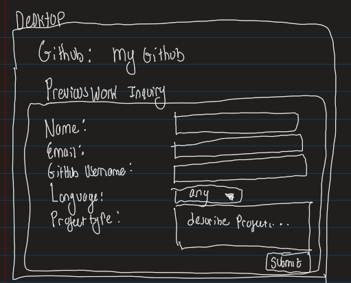
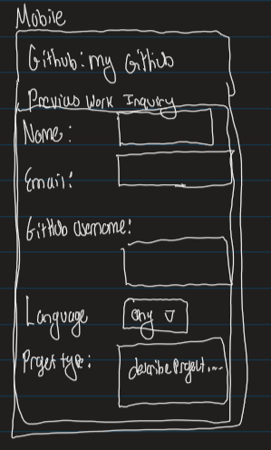
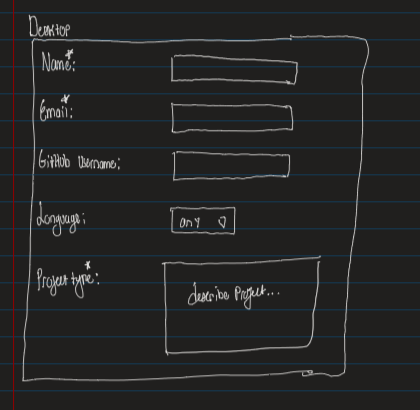
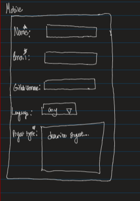
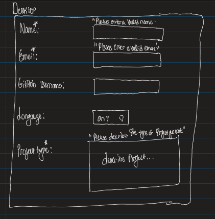
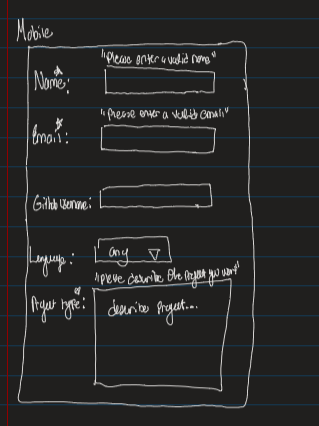

# Project 3: Design Journey

**For milestones, complete only the sections that are labeled with that milestone.**

Be clear and concise in your writing. Bullets points are encouraged.

**Everything, including images, must be visible in Markdown Preview.** If it's not visible in Markdown Preview, then we won't grade it. We won't give you partial credit either.

**Make the case for your decisions using concepts from class, as well as other design principles, theories, examples, and cases from outside of class.**

You can use bullet points and lists, or full paragraphs, or a combination, whichever is appropriate. The writing should be solid draft quality but doesn't have to be fancy.

## Project 1 or Project 2
> Which project will you add a form to?

Project 1

## Audience (Milestone 1)
> Who is your site's target audience? This should be the original audience from Project 1 or Project 2. You may adjust the audience if necessary. Just make sure you explain your rationale for doing so here.

The intended audience is prospective employers and collegues who would want a succient
summary of my academic background and skills to determine whether I would be
a good fit for their company and to get to know more about me.

## Audience's Needs (Milestone 1)
> List the audience's needs that you identified in Project 1 or 2. Just list each need. No need to include the "Design Ideas and Choices", etc. You may adjust the needs if necessary. However, any changes you make to the needs for this project should be clearly identified and justified.

-Information about myself such as which programming languages I'm fluent in,
my work experience, and my favorite passtimes.

-Contact information
to facilitate communication.

-Examples of my previous work to demonstrate skill.

## HTML Form + User Needs Brainstorming (Milestone 1)
> Using the audience needs you identified, brainstorm possible options for an HTML form for the site. List each idea and provide a brief rationale for how the HTML form addresses that need.

- A project inquiry form in which the user can specify a type of project and a competition date and I can response with whether or not I am able to accommodate the request.

- A project history form in which users can specify a certain type of project and I can share any relevant work i've done in the past.

- A contact form.

## HTML Form Proposal & Rationale (Milestone 1)
> Make a decision about your site's form. Describe the purpose of your proposed form for your Project 1 or 2 site. Provide a brief rationale explaining how your proposed form meets the needs of your site's audience.
> Note: If your form is a contact form, we expect to see a thorough justification explaining how a contact form addresses the user's _actual_ needs. In your justification explain how a contact form better suits the needs of your user compared to the alternatives (e.g. sending you an email using your email address).

Form Proposal: project history form

User Needs Rational: One of the needs of my users is to view my previous works in order to assess my programming skills. This form will faciitate that need by allowing users to specify projects i've done in the past based on certain criteria.

## Form User Data (Milestone 1)
> Think through and plan the data you need to collect from the users. Do you need their name? Email address? etc.

- Name
- email address (to share the project with them)
- GitHub username (to add them to the GitHub repo)
- the programming language of the project (Java, HTMl, etc.)
- type of project (game, website, etc.).

## Form Components & Validation Criteria (Milestone 1)
> For each piece of data you plan to collect from the users, identify an appropriate HTML component to collect that data and decide the validation criteria (e.g. whether this data is _required_). Briefly explain your reasoning for the component choice and the validation criteria.

- Name: Required sine I need to know who is making the request. I would use a text box to collect
 the user's name.
- email address is required so that I can contact the user. I'll use the "email" input type.
- GitHub username is optional due to accessibility concerns. I'll use the text box.
- the programming language of the project (Java, HTMl, etc.) is mandatory so that I can ascertain
the type of project the user wants. I'll implement it with a dropdown menu (and the menu will include a default 'any' option)
- type of project so I know what type of project the user wants (e.g. game, compiler, etc.) and
it'll be implemented with a large text box.

## Form Location (Milestone 1)
 (skills.html)

> Sketch the location of the form in that page. This sketch need not be fancy. You don't need to provide many details of the page or form. Just plan the location of the form on the page and communicate that to us. You can literally have a box that says "FORM HERE."

**Desktop Location**

**Mobile Location**

## Form Design (Milestone 1)
> Include sketches on your form below. Include sketches of your **mobile and desktop** versions without corrective feedback. Show us the evolution of your design and the alternatives you considered.

**Desktop Sketches**

**Mobile Sketches**

## Form Feedback Design (Milestone 1)
> Include sketches of your **mobile and desktop** with _corrective feedback_. Show us the evolution of your design and the alternatives you considered.

**Desktop Feedback**

**Mobile Feedback**

## Form Implementation Planning (Milestone 1)
> What submission method will your form use? GET or POST. Explain your reasoning.

I'll use post because I want the data to be private and I want to upload it to a server.

> For your site's `<form>` element, plan all HTML attributes that you will need and their values. Hint: action=, method=, novalidate

- method=Get
- action=https://www.cs.cornell.edu/courses/cs1300/2020fa/submit.php
- novalidate because I want to disable the default HTML validation

## Additional Information (Milestone 1)
> (optional) Include any additional information, justifications, or comments we should be aware of.

I included a contact form in my original submission that I will not be modifying in any way.

## Plan Validation Pseudocode (Final Submission)
> Write your form validation pseudocode here.
    When the user submits a form:

        if the name field is valid (not blank):
            hide name feedback
        else:
            show name feedback

        if the email field is valid (contains a valid email address):
            hide email feedback
        else:
            show email feedback_

        if the project type is valid (not blank):
            hide project type feedback
        else:
            show project type feedback

## Additional Design Justifications (Final Submission)
> If you feel like you haven’t fully explained your design choices in the final submission, or you want to explain some functions in your site (e.g., if you feel like you make a special design choice which might not meet the final requirement), you can use the additional design justifications to justify your design choices. Remember, this is place for you to justify your design choices which you haven’t covered in the design journey. Use it wisely. However, you don’t need to fill out this section if you think all design choices have been well explained in the final submission design journey.

I think my form provides a good way for potential employers/collegues to guage my knowledge of a specific topic by requesting a certain type of project that i've already done. This type of form isn't common (as far as i'm aware), but i think it would have utility for my audience and i therefore elected to implement it.

## Self-Reflection (Final Submission)
> This was the first project in this class where you coded some JavaScript. What did you learn from this experience?

I found that writing out the pseudocode prior to coding helped me a lot. It was also very helpful to review the snipits and their operations prior to attempting the code. It taught me how to reference items and how to perform basic operations on them.

> Reflect on how HTML, CSS, and JavaScript together support client-side interactivity. If it's helpful, you can describe your mental model of client-side interactivity or explain how the general idea of showing and hiding content can be used to implement other forms of client-side interactivity beyond form validation and feedback.

HTML allows us to implement text and elements. CSS allows us to format and style those elements in a way that's appealing and intuitive to users. JavaScript allows us to implement interactivity. For this project, I used the ability of Javascript to add and remove classes (in this case, the hidden class) to implement custom validation for my form. This feature could also have many other applications. For instance, you could hide or display a field based on prior user feedback. If you were designing a survey, it's common to ask the respondent whether they've experienced x, and if so to describe it. If the user responds yes, you could use javascript to then display a textbox and instruct the respondent to describe the event. This betters the user experience because it ensures the user only responds when they experienced the event. Otherwise, the user may feel obligated to respond even when they don't have to/have nothing to say.

> Take some time here to reflect on how much you've learned since you started this class. It's often easy to ignore our own progress. Take a moment and think about your accomplishments in this class. Hopefully you'll recognize that you've accomplished a lot and that you should be very proud of those accomplishments!

I went from not knowing any HTML/CSS or Javascript to being able to code an entire website with interactivity. I think it's a lot of progress for one semester!
